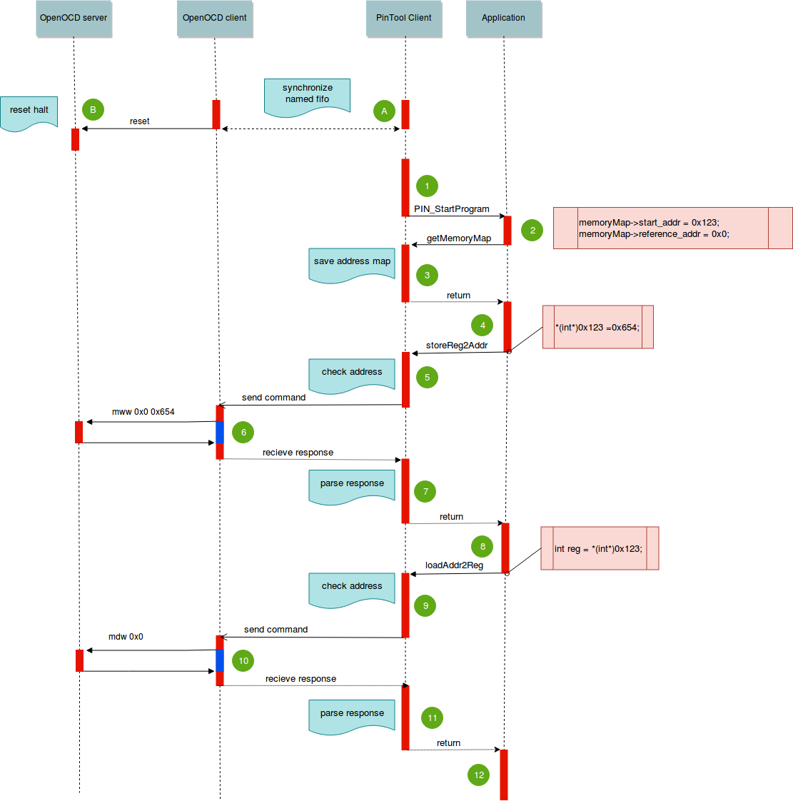

# AddressIntercept

The AddressIntercept is a [pintool](https://software.intel.com/en-us/articles/pin-a-dynamic-binary-instrumentation-tool "pintool") client for a address intercept. I using the trick to run microcontroller code on host machine(x86) with record and read registers of remote processor.
It may be necessary to test assembled boards and to carry out experiments with the microcontroller periphery.

#### Example Use Cases:
Hardware testing. Running microcontroller program on PC with translation address to microcontroller.\
https://github.com/ser-mk/addrIntercept-example-UART-DMA


The AddressIntercept consist from two part. It is a directly pintool client (addrIntercept.cpp) and a OpenOCD client(OCDclient.py) to send command "record" and "read" to OpenOCD server.
This parts to communicate with each other using named fifo.
The OpenOCD client is a python script and requies version 3.5m and above.


### Workflow:


- mark A: sychronization named fifo for communicating clients
- B: reset and halt microcontroller
1.  Started up the intercepted program(Application)
2.  Remap intercepted address. For example, register address 0x0 remap in 0x123 address of prepared buffer.
3.  Save remap address in pintool client to check in future
4.  When value trying to save in remap address.
5.  Pintool client intercept the value and address, and pass to openOCD client through named fifo.
6. OpenOcd client send command mww to openocd server and then pass answer to pintool client.
7. The Pintool client parse answer and continue to implement the application.
8. When trying to read from remap address.
9. Pintool client intercept reading  address, and pass to openOCD client through named fifo.
10. OpenOcd client send command mdw to openocd server and then pass answer to pintool client.
11. The pintool client parse answer and recognized value then pass the value to application.
12. Continue the application.


### Quick Start:
Start up OpenOCD server, openOCD client and pintool cleint with a intercepted application.
it is a example using USB st-link and stm32F4 MCU :
```bash
openocd -f interface/stlink-v2.cfg -f board/stm32f4discovery.cfg # openOCD server
mkfifo in.fifo out.fifo # named fifo for communicating parts
python3.5m OCDclient.py # openOCD client
pin   -t  addrIntercept.so -- ./Application # pintool cleint with Application
```

### How Build
Tested on Ubuntu 16.04 LTS and Pintool v 3.7
1.  Download [pintool](https://software.intel.com/sites/landingpage/pintool/downloads/pin-3.7-97619-g0d0c92f4f-gcc-linux.tar.gzhttp:// "pintool")
2. Unpack archive
3. cd pin-3.7-97619-g0d0c92f4f-gcc-linux/source/tools/
4. git clone git@github.com:ser-mk/AddressIntercept.git
5. cd AddressIntercept

###### Then:
For work with 64-bit application, please use:\
make TARGET=obj-intel64\
32-bit:\
make TARGET=obj-ia32

Run:\
64-bit:\
../../../pin -t obj-intel64/addrIntercept.so -- $PATH_YOUR_APPLICATION_64BIT\
32-bit:\
../../../pin -t obj-ia32/addrIntercept.so -- $PATH_YOUR_APPLICATION_32BIT\
