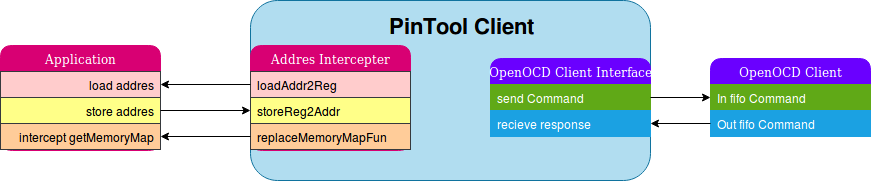

# AddressIntercept

AddressIntercept is [pintool](https://software.intel.com/en-us/articles/pin-a-dynamic-binary-instrumentation-tool "pintool") client for аn address intercept. The instrument intercepts read-write operations of certain memory addresses. It also includes OpenOCD client, which interacts with OpenOCD server. Together they provide easy to use remote control of a microcontroller periphery.

For example: if you need to control a GPIO of stm32f103 MCU from a PC program. You can  use the trick in your own code:
```cpp
#include "stm32f1xx.h"
GPIOC->BSRR = GPIO_BSRR_BS13;
```

After preprocessing, will have:
```cpp
(int*)(0x40011010) = 0x2000;
```

This tool allows to intercept the write operation (at 0x40011010 address) on host PC and passes wrote value to the corresponding GPIO register (with 0x40011010 address) of stm32f103 by using OpenOCD.

Similarly, the same procedure for the read address operation. If you need to know what is a logic level on input pins of stm32f103 MCU:
```cpp
uint32_t statusPins = GPIOС->IDR;
```

After preprocessing, will have:
```cpp
uint32_t statusPins = (int*)(0x40011008);
```

AddressIntercept intercepts the read operation (at 0x40011008 address) on host PC, then reads the value from GPIO register (with 0x40011008 address) by using OpenOCD and returns the value to program.

In addition, the method allows you to use driver libraries provided by vendors or third parties. The example below exhibits the use of Standard Peripherals Library​ from STMicroelectronics company and Direct Memory Access (DMA):

https://github.com/ser-mk/AddressIntercept-example-UART-DMA


### Basics
AddressIntercept consists of two parts. It is directly Pintool client (addrIntercept.cpp) and OpenOCD client(OCDclient.py) for  sending "write" and "read" commands (mww and mdw commands) to OpenOCD server. These parts communicate with each other using named fifo. OpenOCD client is a python script and requires version Python3.5m and above.
tps://github.com/ser-mk/addrIntercept-example-UART-DMA



### Workflow:


- mark A: synchronization of named fifo to communicate clients
- B: reset and halt microcontroller
1.  Starting up of the intercepted program (Application)
2.  Remapping of an intercepted addresses. For example, register address 0x0 remaps to 0x123 address of prepared buffer.
3.  Saving of the remapped(0x123) and original(0x0) addresses inside Pintool client for the future checks.
4.  When application is trying to write value(0x654) in remapped address(0x123), then ...
5.  Pintool client intercepts the value(0x654) and address(0x123) of the write operation, and makes a write request with value(0x654) and original address(0x0) to OpenOCD client through named fifo.
6. OpenOCD client sends command mww to OpenOCD server and then passes back answer to Pintool client.
7. Pintool client parses answer and continues to implement the application.
8. When application is trying to read from remap address(0x123), then ...
9. The Pintool client intercepts address(0x123) of the read operation and makes read request with original address(0x0) to OpenOCD client through named fifo.
10. OpenOCD client sends command mdw to OpenOCD server and then passes back answer to Pintool client.
11. Pintool client parses answer and recognizes value then returns the value to application.
12. The application continues its operation.


### Quick Start:
How to start up OpenOCD server: openOCD client and pintool client with a intercepted application. Example below uses USB st-link and stm32F4 MCU:
```bash
openocd -f interface/stlink-v2.cfg -f board/stm32f4discovery.cfg # openOCD server
mkfifo in.fifo out.fifo # named fifo for communicating parts
python3.5m OCDclient.py # openOCD client
pin   -t  addrIntercept.so -- ./Application # pintool cleint with Application
```

### How to Build
Tested on Ubuntu 16.04 LTS and Pintool v 3.7
1.  Download [pintool](https://software.intel.com/sites/landingpage/pintool/downloads/pin-3.7-97619-g0d0c92f4f-gcc-linux.tar.gzhttp:// "pintool")
2. Unpack archive
3. cd pin-3.7-97619-g0d0c92f4f-gcc-linux/source/tools/
4. git clone git@github.com:ser-mk/AddressIntercept.git
5. cd AddressIntercept

Perhaps, you will have to install some 32-bit packets for success build. 
<details><summary>32-bit package of my host OS:</summary>
<p>

gcc-5-base:i386, gcc-6-base:i386, libc6:i386, libc6-dev:i386, libdevmapper1.02.1:i386, libfreetype6:i386, libfreetype6-dev:i386, libgcc1:i386, libice6:i386, liblzma5:i386, libpcre16-3:i386, libpcre2-8-0:i386, libpcre3:i386, libpcre3-dev:i386, libpcre32-3:i386, libpcrecpp0v5:i386, libpng12-0:i386, libpng12-dev:i386, libselinux1:i386, libsm6:i386, libstdc++6:i386, libudev1:i386, libuuid1:i386, linux-libc-dev:i386, zlib1g:i386, zlib1g-dev:i386

</p>
</details>

###### Then:
For work with 64-bit application, please use:\
make TARGET=obj-intel64\
32-bit:\
make TARGET=obj-ia32

Run:\
64-bit:\
../../../pin -t obj-intel64/addrIntercept.so -- $PATH_YOUR_APPLICATION_64BIT\
32-bit:\
../../../pin -t obj-ia32/addrIntercept.so -- $PATH_YOUR_APPLICATION_32BIT\


Article in Russian language https://habr.com/post/433504/